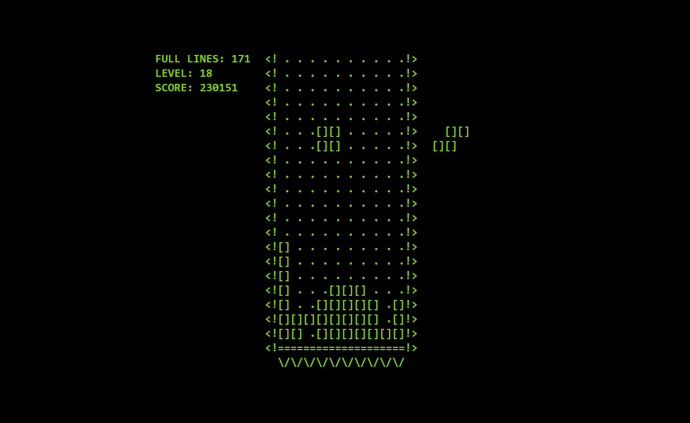

# My Implementation of the Tetris Game

[Try it by visiting this link on mobile or desktop.](https://tetris-dun-tau.vercel.app/)

<div text-align="center">
  
</div>

## Installation

To run Tetris locally, follow these steps:

1. **Clone the Repository**:

   ```bash
   git clone https://github.com/IliaPoliak/tetris.git
   cd tetris
   ```

2. **Install Dependencies**:
   Ensure you have [Node.js](https://nodejs.org/) installed. Then, install the required packages:

   ```bash
   npm install
   ```

3. **Start the Development Server**:
   ```bash
   npm start
   ```
   The app will be available at `http://localhost:3000`.

## Usage

1. Open the app in a web browser.
2. From the **Introduction** screen, click **"PLAY"** (or press **Enter**) to start the game, or **"MENU"** to view controls and scoring.
3. In the **Game** screen, use keyboard or touch controls to move, rotate, and drop tiles.
4. Clear lines to increase your score and level up.
5. Pause the game with the **Esc** key or the **Pause Button** (mobile).
6. If the game ends, view your stats on the **Game Over** screen and retry by clicking **Game Over Logo** or pressing **Enter**.

## Controls

### Keyboard

- **Arrow Up**: Rotate tile right
- **Arrow Left**: Move tile left
- **Arrow Right**: Move tile right
- **Arrow Down**: Soft drop (faster descent)
- **Space**: Hard drop (instant drop)
- **Esc**: Pause/unpause

### Touch (Mobile)

- **Swipe Left/Right**: Move tile left or right
- **Swipe Down**: Soft drop
- **Quick Swipe Down**: Hard drop
- **Tap**: Rotate tile

## Technologies Used

- **React**: For building the user interface and managing state.
- **Tailwind CSS**: For styling and responsive design.
- **JavaScript (ES6+)**: For game logic and interactivity.
- **Vercel**: For hosting.

## Contact

Feel free to reach out if you have questions or feedback!

- **GitHub**: [IliaPoliak](https://github.com/IliaPoliak)
- **Email**: iliapoliak@proton.me
- **LinkedIn**: https://www.linkedin.com/in/ilia-poliak

## Copyrights

This is a fan-made, non-commercial implementation of a Tetris-like game created for educational purposes. This project is not affiliated with, endorsed by, or sponsored by The Tetris Company or any official Tetris entities. The name "Tetris" and any related assets are used solely for descriptive purposes and remain the property of their respective owners.

---

Thank you for checking out my project! I hope you enjoy playing it as much as I enjoyed building it.
